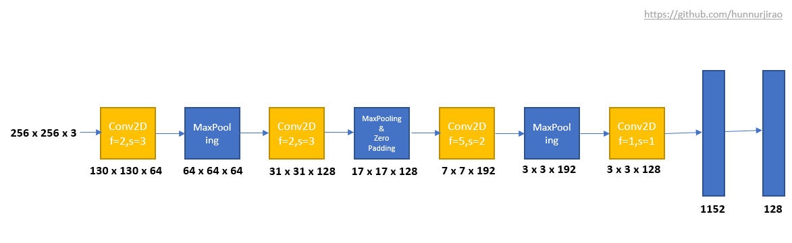

# Face-Detection
Face Detection using CNN

## Overview

Face Detection is one of the applications of Convolution Neural Networks which comes under *Supervised Learning Algorithm.* Here Face verification differs from Face Recognition.(Here I have done *face verification*)

**Face Verification**: Given input as image, name/ID and gives output whether the input image is that of the claimed person or not.

**Face Recognition**: This has a database of K persons, given input as image and outputs an name/ID if the image is any of the K persons(or 'recognized').

## How it works

When we give an input image, the CNN model extract the features of that images and provides the output as 128 dimensional vector. Similarly it does to all images provided. Here that 128 Dimensional vector is the features of the provided image and this varies from image to image. If the given images are of same person, then the difference between the the outputs of these two images(or difference between two vectors) is our loss. We want to reduce loss so that the difference between the output vectors of same persons should be minimum. In the figure below, embedding isnothing but 128 dimensional vector.

## CNN Architecture

## Loss function

Here A - Anchor , P - Positive and N - Negative. Anchor and Positive are similar images and Anchor and Negative are Non-similar images.d(A,P) is the difference between the anchor and positive which should be minimum and similarly d(A,N) is the difference between anchor and negative which should be maximum.Here f(K) is the feature vector of Kth image where K is 128 Dimensional vector. Our goal is to reduce the distance between the anchor and positive images. So the loss function to reduce the distance between anchor and positive is given as 

